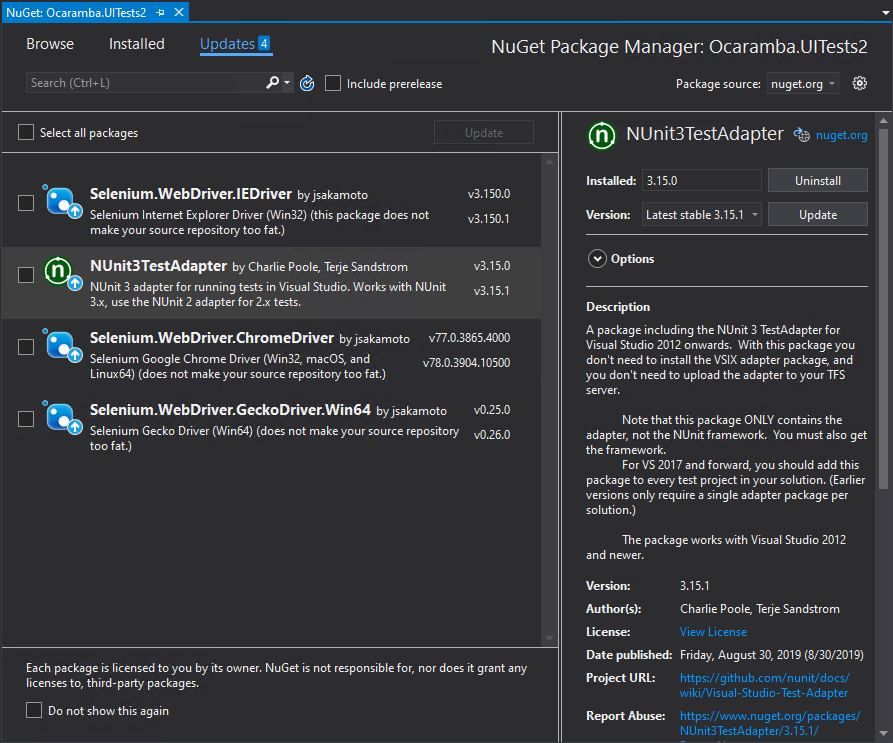

# Ocaramba.templates

The Ocaramba project extension for Visual Studio - a set of project and class templates for web automated testing using [Ocaramba Framework](https://github.com/ObjectivityLtd/Ocaramba).

Thanks to the Ocaramba.Templates you can create in the few minutes ready to use in Continuous Integration tool project test solution for web automated testing. 

The extension contains:

- Project templates:
  - Ocaramba.MsTest (.NET 8.0)
  - Ocaramba.NUnit (.NET 8.0)
- Item templates:
  - Ocaramba Page Object
  - Ocaramba NUnit Test Object
  - Ocaramba MsTest Test Object

## Troubleshooting & Known Issues
In case of problems with executing tests, update at least TestAdapter and Selenium browser drivers.
You can also try to uninstall and install back one of the browser drivers.

In case of build failure due to a missing package, try uninstalling and reinstalling that package again. In case of problems with unistalling package try to update to previous version and than back update to the latest version. 

In case of test execution failure with following error
 
    OneTimeSetUp: System.IO.FileNotFoundException : Could not load fle or assembly 'System.Text.Json, Version=9.0.0.0
 
 
 Add to your csproj file following lines in ItemGroup section

 	<Reference Include="System.Text.Json, Version=9.0.0.0, Culture=neutral, processorArchitecture=MSIL">
      <HintPath>..\packages\System.Text.Json.9.0.0\lib\netstandard2.0\System.Text.Json.dll</HintPath>
    </Reference>

All templates are located on Visual Studio's **New Project** and **New Item** windows inside **Ocaramba** category.

*Find out more on [Ocaramba](https://github.com/ObjectivityLtd/Ocaramba).*

Download Ocaramba Visual Studio templates 

#### Where to start?
-------------
- See [Getting started](https://github.com/ObjectivityLtd/Ocaramba/wiki/Getting%20started).
